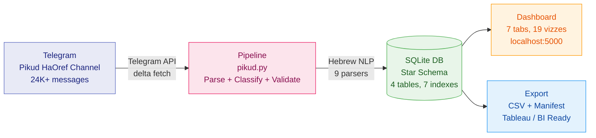
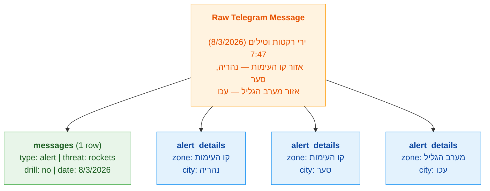
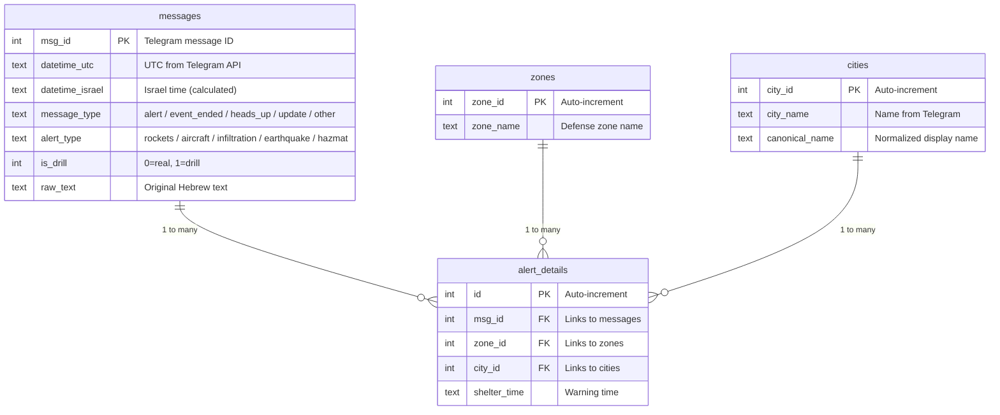

# Pikud Alert Pipeline

**On Feb 28, 2026, war broke out in Israel. Missiles filled the skies. And within hours, vibe coders filled Twitter with dashboards.**

**But none of them asked: is the data actually right?**

This project is the answer to that question. It's a case study in what happens when you go beyond "just scrape and chart" — when you treat wartime alert data with the rigor it deserves. AI wrote most of the code. But it took a data engineer to make the data *trustworthy*.

> **24,000+ alerts parsed. 316K city-level records. 9 Hebrew text parsers. 179 tests. Exported to Tableau Next on Salesforce Data Cloud.** Read the full story in [STORY.md](STORY.md).

    

```bash
python3 -m venv venv && source venv/bin/activate  # create & activate virtual environment
make install && cp .env.example .env               # one-time setup (needs free Telegram API key)
make fetch && make run                             # fetch alerts → build DB → dashboard at localhost:5000
```

> **Setup requires a free [Telegram API key](https://my.telegram.org)** — takes 2 minutes, no paid tier. See [full installation guide](#-installation) below.

---

### :rocket: Using Claude Code? Skip the README.

This repo includes a [`CLAUDE.md`](CLAUDE.md) file — Claude Code reads it automatically. Just clone, open the project, and ask:

```
> Help me set up this project
> Fetch the latest alerts and show me the dashboard
> Add a new visualization for weekly trends
> Export data for Tableau
```

Claude knows the architecture, the domain rules, the edge cases, and every command. No README needed — just talk to it.

---

<table>
<tr>
<td width="50%">

### What you get

| | |
|---|---|
| :satellite: | **Live pipeline** — fetch alerts from Telegram, incremental delta updates |
| :bar_chart: | **19 visualizations** — daily trends, top cities, hourly patterns, heatmaps |
| :mag: | **Stackable filters** — by date, threat type, zone, city |
| :iphone: | **Mobile-ready** — Hebrew/English summary page |
| :package: | **Tableau export** — CSV + manifest with calculated field formulas |
| :test_tube: | **179 tests** — parsers, API, database, performance, data integrity |
| :shield: | **8 validation checks** — every pipeline run verified |

</td>
<td width="50%">

### The numbers

| | |
|---|---|
| **24,000+** | Telegram messages processed |
| **19,000+** | Real alert messages identified |
| **~5,600** | Actual attack events (2-min grouping) |
| **~2,000** | Cities/settlements tracked |
| **36** | Defense zones mapped |
| **5** | Threat types classified |
| **9** | City name variants canonicalized |
| **< 600ms** | Every endpoint, every time |

</td>
</tr>
</table>

---

## :thinking: The Prompt That Doesn't Work

> *"Here's a Telegram channel with Israel's rocket alert data. Build me a dashboard."*

Any LLM will generate code for this. You'll get a CSV dump, some charts, maybe a Flask app. It'll look great in a demo.

**And it'll be wrong.**

<table>
<tr>
<th width="50%">:robot: What AI generates</th>
<th width="50%">:brain: What this repo does</th>
</tr>
<tr>
<td>Counts 24K "alerts"</td>
<td>Classifies 9 message types — only 19K are real alerts</td>
</tr>
<tr>
<td>Flat CSV, reloaded every time</td>
<td>Star schema DB with delta fetching and versioning</td>
</tr>
<tr>
<td>Treats "נהריה סער עברון" as 1 city</td>
<td>Splits into 3 cities using Hebrew prefix dictionary</td>
</tr>
<tr>
<td>Shows "אבו-גוש" AND "אבו גוש" as separate cities</td>
<td>Canonicalizes 9 dash/space pairs — one entry, correct count</td>
</tr>
<tr>
<td>Trusts UTC timestamps</td>
<td>Extracts Israel time from Hebrew text (UTC can be 10hrs off)</td>
</tr>
<tr>
<td>No validation — silent data corruption</td>
<td>8 checks on every run: no duplicates, no orphans, counts match</td>
</tr>
<tr>
<td>One-time demo</td>
<td>Production pipeline with delta updates, rebuild, and rollback</td>
</tr>
</table>

> **AI wrote most of the code in this repo.** But it needed an engineer who spent time with 24,000 Hebrew messages to know what "correct" looks like. See [STORY.md](STORY.md) for the full account.

---

## :world_map: How It Works



### What the parser actually does

One Telegram message becomes multiple database rows:



> **1 message :arrow_right: 1 row in `messages` + 3 rows in `alert_details`**
> That's why the schema is a star, not a flat table.

---

## :key: Installation

```bash
git clone https://github.com/ronikurtberg/pikud-alert-pipeline.git
cd pikud-alert-pipeline
python3 -m venv venv            # Create virtual environment
source venv/bin/activate        # Activate it (run this each new terminal session)
make install                    # Install Python dependencies
```

> **Why a virtual environment?** Modern macOS and many Linux distros block `pip install` at the system level ([PEP 668](https://peps.python.org/pep-0668/)). A venv keeps everything isolated and avoids the `externally-managed-environment` error.

**Telegram API key** (free, 2 minutes):
1. Go to [my.telegram.org](https://my.telegram.org) and log in with your phone number
2. Click **"API development tools"** and create an app
3. Copy your credentials:

```bash
cp .env.example .env            # Then edit .env with your api_id and api_hash
```

**Run the pipeline:**

```bash
source venv/bin/activate        # If not already activated
make fetch                      # Fetch all 24K+ alerts + build database
make run                        # Dashboard at http://localhost:5000
```

On first run, you'll authenticate once via phone + code. The session is cached.

---

## :desktop_computer: Dashboard — 7 Tabs

| Tab | What's inside |
|---|---|
| :chart_with_upwards_trend: **Overview** | Live alert ticker, 6 KPI cards, daily timeline, top cities, hourly distribution |
| :detective: **Intelligence** | 15+ vizzes: monthly trends, zone treemap, drone cities, radar, heatmap, streaks, multi-zone attacks |
| :card_file_box: **Data Model** | Interactive ERD, calculated field docs, schema comparison |
| :arrows_counterclockwise: **Data Journey** | Animated pipeline: watch raw Hebrew become structured data |
| :wrench: **Pipeline** | Run delta/rebuild/validate from UI, live logs, version inventory, random message audit |
| :bar_chart: **Tableau Ready** | Export CSVs + manifest for Tableau, Salesforce Data Cloud, any BI tool |
| :mag_right: **SQL** | Query editor with syntax highlighting + sample queries |

### :iphone: Mobile Summary (`/summary`)

Hebrew/English toggle, city search with drill-down cards, summary stats. Share via WiFi or ngrok.

### :jigsaw: Filters

All visualizations respond to stackable filters:

| Filter | Options |
|---|---|
| :calendar: **Period** | All Data, Last 7D, Last 30D, custom range |
| :boom: **Threat** | Rockets, Aircraft, Infiltration, Earthquake, Hazmat |
| :round_pushpin: **Zone** | Autocomplete across 36 defense zones |
| :cityscape: **City** | Autocomplete across ~2,000 cities |

---

## :floppy_disk: Database Schema



---

## :gear: Pipeline Commands

| Command | What it does |
|---|---|
| `make fetch` | Smart fetch: full download on first run, delta after |
| `make run` | Start dashboard at localhost:5000 |
| `make test` | Run all 179 tests |
| `python3 pikud.py delta` | Fetch only new messages |
| `python3 pikud.py rebuild_db` | Rebuild DB from existing CSVs |
| `python3 pikud.py validate` | Run 8 validation checks |
| `python3 pikud.py status` | Show version, counts, last run |

---

## :package: Tableau / BI Export

Two export modes from the **Tableau Ready** tab:

| Mode | Best for |
|---|---|
| :white_check_mark: **Full Export** | Immediate analysis — all calculated fields pre-computed |
| :triangular_ruler: **Raw + Formulas** | Recurring pipelines — formulas in manifest.json for your semantic model |

Each ZIP: `messages.csv` + `alert_details.csv` + `cities.csv` + `zones.csv` + `manifest.json`

:arrow_right: See [TABLEAU_GUIDE.md](TABLEAU_GUIDE.md) for the complete Salesforce Data Cloud + Tableau Next deployment guide with all 18 calculated field formulas.

---

## :test_tube: Testing

```bash
make test                                # All 179 tests
python3 -m pytest tests/ -k parsers     # Parser tests only
python3 -m pytest tests/ -k api         # API tests only
```

| Suite | Tests | What it verifies |
|---|---|---|
| :abc: **Parsers** | 33 | Message classification, date extraction, space-split, multi-word prefixes |
| :globe_with_meridians: **API** | 77 | All endpoints, filters, drilldown, export, Tableau tab, SQL injection blocking |
| :floppy_disk: **Database** | 28 | Schema, integrity, canonicalization, calculated fields |
| :stopwatch: **Performance** | 30 | Per-endpoint latency budgets (<100ms / <300ms / <600ms) |
| :shield: **Data Integrity** | 11 | Filter dedup, no concatenations, version consistency |

---

## :file_folder: Project Structure

```
pikud.py                  Pipeline: fetch, parse, build DB, validate
dashboard.py              Flask server + all routes
dashboard_app/
  db.py                   DB connection, query helpers
  filters.py              Filter clause builders
  metadata.py             SQL documentation constants
  export.py               CSV/ZIP export with Tableau formulas
templates/
  dashboard.html          Main dashboard (single-page app)
  summary.html            Mobile summary page
config.py                 Prefilter configurations
conftest.py               Pytest fixtures
tests/                    179 tests across 5 suites
TABLEAU_GUIDE.md          Tableau Next deployment guide
STORY.md                  Project background and data lessons
```

---

## :handshake: Contributing

PRs welcome. Run `make test` before submitting.

## :scroll: License

[MIT](LICENSE)
